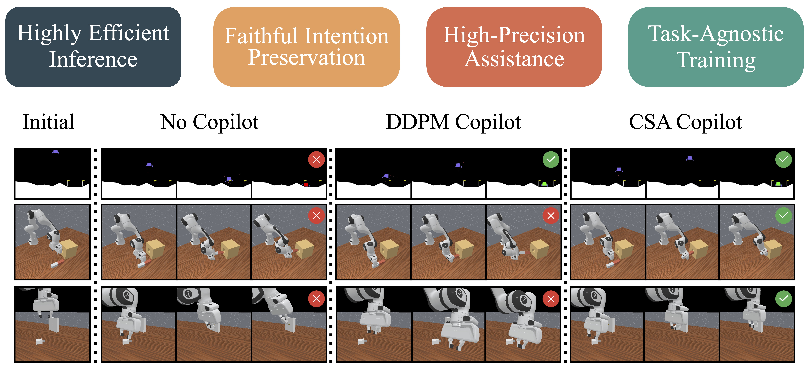

<p align="center">
  <h1 align="center">FlashBack: Consistency Model-Accelerated Shared Autonomy</h1>
</p>

<p align="center">
  <b>Luzhe Sun</b> &nbsp;·&nbsp; <b>Jingtian Ji</b> &nbsp;·&nbsp; <b>Xiangshan (Vincent) Tan</b> &nbsp;·&nbsp; <b>Matthew R. Walter</b><br/>
  <sub>Toyota Technological Institute at Chicago</sub>
</p>

<p align="center">
  
</p>

<p align="center">
  <a href="https://ripl.github.io/CSA-website/"></a>
  <a href="https://proceedings.mlr.press/v305/sun25a.html"></a>
  <a href="https://www.python.org/downloads/"></a>
  <a href="https://pytorch.org/"></a>
  <a href="https://github.com/facebookresearch/hydra"></a>
</p>

<p align="center">
  <a href="https://ripl.github.io/CSA-website/"><b>Project website</b></a> &nbsp;|&nbsp;
  <a href="https://proceedings.mlr.press/v305/sun25a.html"><b>Paper (PMLR Proceedings)</b></a>
</p>

---

## TL;DR

Code framework for **shared autonomy**: train a **expert** (RL or heuristic), roll out **expert–human-style** data, fit **DDPM** and **EDM (Karras)** policies on transitions, **distill** a fast **consistency model (CM)**, and assist a flawed user policy at run time. The repo also trains a **next-state (forward) model** used with **dropout** so inference can mimic **classifier-free guidance**–style control over how much the predictor is trusted.

---

## Highlights

| | |
|:---:|:---|
| **Pipeline** | Expert RL → data collection → DDPM → joint EDM → joint CM distillation |
| **ManiSkill** | Charger plug & peg insertion; **curriculum RL** for the charger task (`expert_ppo_cl_charger`) |
| **Forward model** | Trained next-state predictor; optional **CFG-like** behavior at inference via dropout / `use_predict_next_state` |
| **Environments** | Lunar Lander variants, ManiSkill tasks, optional Safety-Gymnasium and UR5 helpers |
| **Config** | [Hydra](https://github.com/facebookresearch/hydra) YAML under `configs/`; `root_dir: ${hydra.runtime.cwd}` — run from **repository root** |

---

## Method sketch

1. **Expert policy** (SAC / PPO / BC depending on task) generates near-optimal behavior.
2. **Dataset** of transitions (state, action, next state) with optional user perturbations (`randp`, `perturb_method`, etc.).
3. **DDPM** and **joint EDM** model the action (and deltas) conditioned on state and predicted/future state; EDM uses a Karras-type schedule and optional weighting / normalization.
4. **Joint CM** distills the EDM teacher for few-step sampling.
5. At **inference**, the assistive stack can blend user actions with CM samples; the **forward model** and its training-time dropout enable guidance-style control over reliance on next-state prediction.

---

## Repository layout

```
configs/           # Hydra configs (lunar/, maniskill/, safetygym/, deprecated/)
diffusha/          # Core library: envs, algorithms, models, data, utils
scripts/lunar/     # Lunar Lander: expert, collect, train diffusion, eval
scripts/maniskill/ # ManiSkill: expert (incl. curriculum), collect, train, eval
scripts/safetygym/ # Optional Safety-Gymnasium workflows
model_param/       # Local-only: weights & logs (ignored by git; see .gitignore)
data/              # Your datasets and eval CSVs (create locally; many patterns gitignored)
```

---

## Installation

```bash
cd Shared-Autonomy-Diffusion-release
pip install -r requirements.txt
```

Additional setup depends on the simulator you use (e.g. **ManiSkill3**, **Gymnasium** Lunar Lander, **Safety-Gymnasium**). Install those stacks in the same environment as needed.

---

## What to run (order)

Always run commands from the **repository root** so `${hydra.runtime.cwd}` and relative paths resolve. Create local directories as needed, e.g. `mkdir -p data/eval model_param/weight model_param/log`.

### A. Lunar Lander (reference stack)

| Step | Script | Config package | Notes |
|:---:|:---|:---|:---|
| 1 | `python scripts/lunar/train_expert.py` | `configs/lunar/expert.yaml` | SAC expert; checkpoints under `model_param/weight/lunar_expert/` |
| 2 | `python scripts/lunar/collect_data.py` | `configs/lunar/data_collection.yaml` | Set `dataset.directory` / expert path after step 1 |
| 3 | `python scripts/lunar/train_diffusion.py` | `train_ddpm` / `train_joint_edm` / `train_joint_cm` inside the file | Edit `config_name` in `__main__` and YAML dataset paths |
| 4 | `python scripts/lunar/eval_diffusion.py` | e.g. `eval_joint_cm`, `eval_ddpm` | Set `model_dir` or checkpoint paths in YAML |

Forward-model training is configured from `configs/lunar/forward_model.yaml` (paths relative to repo root).

### B. ManiSkill (charger & peg)

| Step | Script | Config | Notes |
|:---:|:---|:---|:---|
| 1a | `python scripts/maniskill/train_expert_maniskill_charger.py` | `expert_ppo_charger` | Standard PPO charger expert |
| 1b | *or* same file with `train_CL_charger_expert()` | `expert_ppo_cl_charger` | **Curriculum** charger training (`CL_run`) |
| 2 | `python scripts/maniskill/collect_maniskill_data_charger.py` (or `_peg`) | `data_collection_maniskill_*.yaml` | Set `model_path` to your expert checkpoint |
| 3 | `python scripts/maniskill/train_diffusion.py` | e.g. `train_ddpm_charger`, `train_joint_edm_charger`, `train_joint_cm_charger` | Switch `config_name` in `__main__` |
| 4 | `python scripts/maniskill/eval_diffusion_maniskill.py` | `eval_diffusion_*` yaml | Fill `model_dir` / `ddpm_model_path` / `expert_model` placeholders |

Forward models: `configs/maniskill/forward_model_charger.yaml`, `forward_model_peg.yaml`.

### C. Safety-Gymnasium (optional)

| Step | Script | Config dir |
|:---:|:---|:---|
| Collect | `scripts/safetygym/collect_sa_data.py` | `configs/safetygym/data_collection_sa.yaml` |
| Train | `scripts/safetygym/train_diffusion_sa.py` | `train_joint_edm_sa`, `train_joint_cm_sa`, … |
| Eval | `scripts/safetygym/eval_diffusion_sa.py` | `eval_diffusion_sa.yaml` |

### D. Legacy / single-file entrypoints

- `scripts/eval_diffusion.py` — older multi-task file; Hydra `config_path` values were updated to `configs/lunar` or `configs/deprecated` per entry point. Prefer `scripts/lunar/eval_diffusion.py` for Lunar workflows.
- `scripts/train_expert.py` / `scripts/train_diffusion.py` at repo root (if present): align `config_path` with the layout above.

### E. UR5 preprocessing (optional)

```bash
python data_transform.py --raw-dirs /path/to/raw --save-dir /path/to/out --new-name ur5_run1
```

---

## Config placeholders

YAML files use tokens such as `<YOUR_EXPERT>`, `<YOUR_COLLECTED_TRANSITION_DATASET>`, `<YOUR_JOINT_EDM>.pth`, and `<YOUR_JOINT_CM_RUN_DIR>`. Replace them with **your** local paths after training. No pretrained weights are provided in git.

---

## Citation

If you use this code or ideas from **Consistency Shared Autonomy (CSA) / FlashBack**, please cite:

```bibtex
@inproceedings{sun2025flashback,
  title={FlashBack: Consistency Model-Accelerated Shared Autonomy},
  author={Sun, Luzhe and Ji, Jingtian and Tan, Xiangshan and Walter, Matthew},
  booktitle={Conference on Robot Learning},
  pages={924--940},
  year={2025},
  organization={PMLR}
}
```

Official proceedings page: [PMLR 305 (CoRL 2025)](https://proceedings.mlr.press/v305/sun25a.html). Project site with figures and summary: [CSA / FlashBack](https://ripl.github.io/CSA-website/).

---

## Acknowledgments

Built with [PyTorch](https://pytorch.org/), [Hydra](https://github.com/facebookresearch/hydra), [Gymnasium](https://gymnasium.farama.org/), and related RL / robotics stacks. README structure inspired by open-source projects such as [HALP](https://github.com/Zesearch/HALP).
